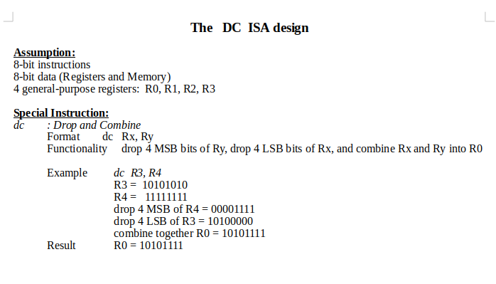
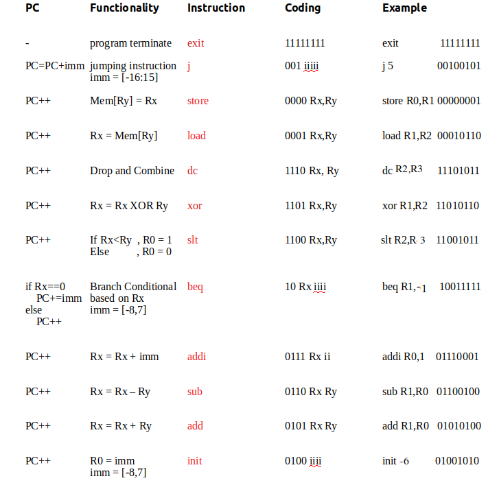

# ECE366 Project 3 Sample
## Simple simulator for DC ISA, created by the TA
Instructor: Wenjing Rao.  
Grad TA's version: DC-sim.py,   program_TRUNG.txt  
````
To run simulator on Terminal  :  python DC-sim.py
````

#Comment: since there's no R4, I assume the DC example should be concerned with R3 and R2.

The DC ISA:  




